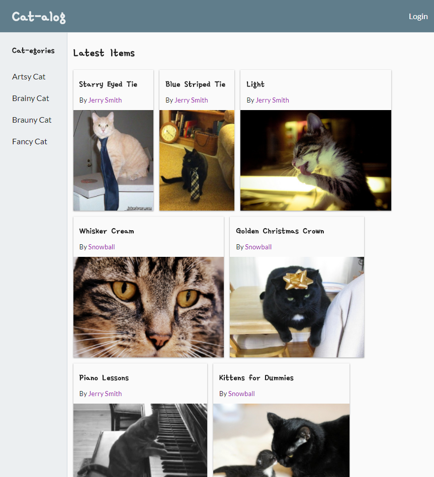
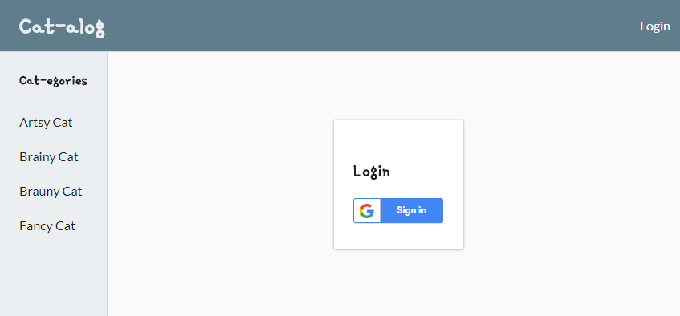
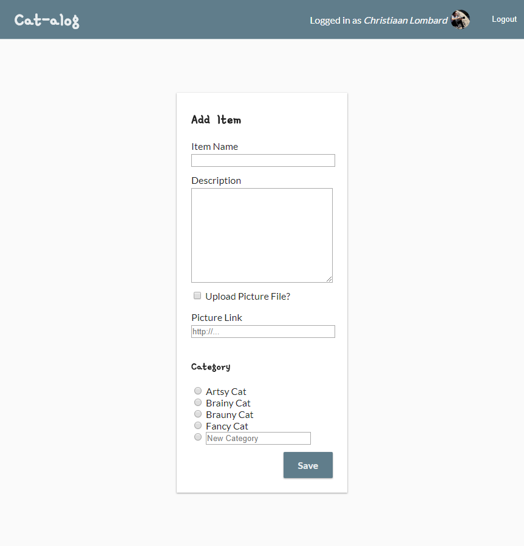
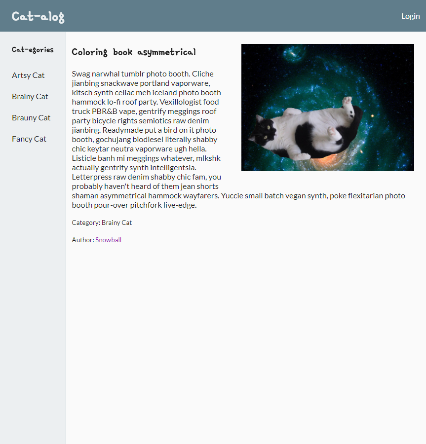
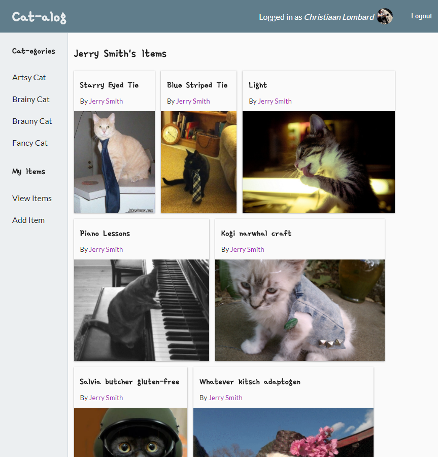

# Udacity Project - Item Catalog

This is my project submission for the Udacity Fullstack Developer Nanodegree, Backend Module, Item Catalog Project.

This project showcases a item catalog web application supporting CRUD operations, JSON api and Google OAuth.

**Features:**
 - Add, remove, update, delete items and categories
 - Third party authentication (Google OAuth)
 - CSFR Token form protection
 - JSON API


## Install & Run

### VM

To run the application inside a VM, install [Vagrant]() and run:

```sh
vagrant up
vagrant ssh
```

In the vm shell go to the synced folder:

```sh
cd /vagrant
```

### Install

  1. Place a Google OAuth Secrets JSON file in `src/google_client_secrets.json`
  2. The default file upload path is `src/static/pictures`, ensure this folder can be written to.
  3. A seeded sqlite DB is provided (`catalog.db`), but can be recreated by running `python src/seed.py`

### Run

To start the web server run `python ./src/catalog.py`. Access the webserver on [localhost:5000](http://localhost:5000/)

## Screenshots

*Home [localhost:5000](http://localhost:5000/)*


*Login [localhost:5000/login](http://localhost:5000/login)*


*Add Item [localhost:5000/items/add](http://localhost:5000/items/add)*


*Item Detail [localhost:5000/items/13](http://localhost:5000/items/13)*


*User Items [localhost:5000/user/1/items](http://localhost:5000/user/1/items)*

*Item Category [localhost:5000/items/brauny](http://localhost:5000/items/brauny)*


*API Item Detail [localhost:5000/api/items/1](localhost:5000/api/items/1)*
```js
{"picture": "LINK:http://78.media.tumblr.com/tumblr_llz72e9zcQ1qjahcpo1_400.jpg", "description": "\n            Be interview ready with a fancy tie.\n            Lorem ipsum dolor amet snackwave craft beer echo park pitchfork, YOLO microdosing health goth iPhone.\n        ", "category_slug": "fancy", "id": 1, "name": "Starry Eyed Tie"}
```


## Udacity Project Specifications

You will develop an application that provides a list of items within a variety of categories as well as provide a user registration and authentication system. Registered users will have the ability to post, edit and delete their own items.

### Project Display Example

**Note: The screenshots on this page are just examples of one implementation of the minimal functionality. You are encouraged to redesign and strive for even better solutions.**

The Item Catalog project consists of developing an application that provides a list of items within a variety of categories, as well as provide a user registration and authentication system.


**In this sample project, the homepage displays all current categories along with the latest added items.**
*http://localhost:8000/*


**Selecting a specific category shows you all the items available for that category.**
*http://localhost:8000/catalog/Snowboarding/items*


**Selecting a specific item shows you specific information of that item.**
*http://localhost:8000/catalog/Snowboarding/Snowboard*


**After logging in, a user has the ability to add, update, or delete item info.**
*http://localhost:8000/ (logged in)*


*http://localhost:8000/catalog/Snowboarding/Snowboard (logged in)*


*http://localhost:8000/catalog/Snowboard/edit (logged in)*


*http://localhost:8000/catalog/Snowboard/delete (logged in)*


**The application provides a JSON endpoint, at the very least.**
*http://localhost:8000/catalog.json*


